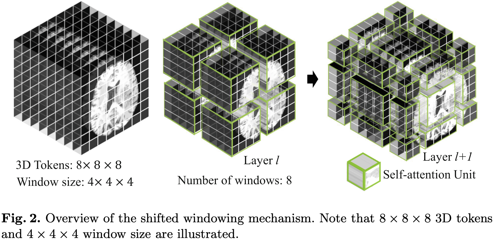

# [论文笔记] Swin UNETR 论文笔记: MRI 图像脑肿瘤语义分割

Author: <a href="https://yusijin02.github.io/">Sijin Yu</a>

[1] Ali Hatamizadeh, Vishwesh Nath, Yucheng Tang, Dong Yang, Holger R. Roth, and Daguang Xu. *Swin UNETR: Swin Transformers for Semantic Segmentation of Brain Tumors in MRI Images*. MICCAI, 2022.

<a href="https://github.com/Project-MONAI/research-contributions/tree/main/SwinUNETR">📎开源代码链接</a>

[TOC]

## 1. Abstract

- 脑肿瘤的语义分割是一项基本的医学影像分析任务, 涉及多种 MRI 成像模态, 可协助临床医生诊断病人并随后研究恶性实体的进展.
- 近年来, 完全**卷积神经网络 (Fully Convolutional Neural Networks, FCNNs)** 方法已成为 3D 医学影像分割的事实标准.
- 流行的 “U形” 网络架构在不同的 2D 和 3D 语义分割任务以及各种成像模式上实现了最先进的性能基准.
- 然而, 由于 FCNNs 中卷积层的核大小有限, 它们在建模长距离信息方面的性能是次优的, 这可能导致在分割大小不一的肿瘤时出现缺陷.
- 另一方面, Transformer 模型在多个领域展示了捕获长距离信息的卓越能力, 包括自然语言处理和计算机视觉.
- 受 ViT 及其变体成功的启发, 我们提出了一种名为 **Swin UNEt TRansformers (Swin UNETR)** 的新型分割模型.
- 具体来说, 3D 脑肿瘤语义分割任务被重新定义为**序列到序列预测问题**, 其中多模态输入数据被投影成一维嵌入序列, 并用作层级 Swin 变换器编码器的输入.
- Swin Transformer 编码器**使用移位窗口计算自注意力**, 在五个不同的分辨率上提取特征, 并通过跳跃连接在每个分辨率上连接到基于FCNN 的解码器.
- 我们参加了 2021 年 BraTS 分割挑战赛, 我们提出的模型在验证阶段位列表现最佳的方法之一.

## 2. Motivation & Contribution

### 2.1 Motivation

- 在医疗保健的人工智能领域, 特别是脑肿瘤分析中, 需要更先进的分割技术来准确划定肿瘤, 以便诊断和术前规划.
- 当前基于 CNN 的脑肿瘤分割方法由于其小感受野, 难以捕捉长距离依赖关系.
- ViTs 在捕捉各种领域的长距离信息方面显示出潜力, 暗示其在改善医学图像分割中的适用性.

### 2.2 Contribution

- 提出了一种新型架构, Swin UNEt TRansformers (Swin UNETR), 结合了 Swin Transformer 编码器与 U 形 CNN 解码器, 用于多模态三维脑肿瘤分割.
- 在 2021 年多模态脑肿瘤分割挑战 (BraTS) 中展示了 Swin UNETR 模型的有效性, 验证阶段取得了排名靠前的成绩, 并在测试中表现出竞争力.

## 3. Model


1. **将输入的图像打成 Patch**.

   输入的图像为 $X\in\mathbb R^{H\times W\times D\times S}$. 一个 Patch 的分辨率为 $(H',W',D')$, 一个 Patch 的形状为 $\mathbb R^{H'\times W'\times D'\times S}$.

   则图像变为一个 Patch 的序列, 序列长度为 $\lceil\frac{H}{H'}\rceil\times\lceil\frac{W}{W'}\rceil\times\lceil\frac{D}{D'}\rceil$.

   在本文中, Patch size 为 $(H',W',D')=(2, 2, 2)$.

   对于每个 patch, 将其映射为一个嵌入维度为 $C$  的 token. 因此, 最终得到分辨率为 $(\lceil\frac{H}{H'}\rceil,\lceil\frac{W}{W'}\rceil,\lceil\frac{D}{D'}\rceil)$ 的 3D tokens. 

2. **对 3D tokens 应用 Swin Transformer**.

   一层 Swin Transformer Block 由两个子层组成: W-MSA, SW-MSA.

   经过一层 Swin Transformer Block, 一个 3D tokens 每个方向上的分辨率变为原来的 $\frac12$, 通道数变为原来的 $2$ 倍. 见 Fig.1 的左下角.

   W-MSA 和 SW-MSA 分别是规则的、循环移动的 partitioning multi-head self-attention, 如下图所示.

   

## 4. Experiment

### 4.1 Dataset

- BraTS 2021

### 4.2 对比实验


## 5. Code

以下链接提供了使用Swin UNETR模型进行BraTS21脑肿瘤分割的教程:[](https://colab.research.google.com/github/Project-MONAI/tutorials/blob/main/3d_segmentation/swin_unetr_brats21_segmentation_3d.ipynb)

下面是部分核心代码注释:

### 5.1 数据预处理和增强

```Python
from monai import transforms

train_transform = transforms.Compose(
  [	
  	# 读入图像
    transforms.LoadImaged(keys=["image", "label"]),
    
		# 将单通道的标签图像转换成多通道格式, 每个通道表示不同的肿瘤类别. (转换前是所有类别标签图共用一个单通道图像)    transforms.ConvertToMultiChannelBasedOnBratsClassesd(keys="label"),
		# 裁剪掉图像周围的背景区域
    transforms.CropForegroundd(
        keys=["image", "label"],
        source_key="image",
        k_divisible=[roi[0], roi[1], roi[2]],
    ),
    # 将图像随机裁剪为指定大小
    transforms.RandSpatialCropd(
        keys=["image", "label"],
        roi_size=[roi[0], roi[1], roi[2]],
        random_size=False,
    ),
    # 在0轴方向上随机翻转
    transforms.RandFlipd(keys=["image", "label"], prob=0.5, spatial_axis=0),
    # 在1轴方向上随机翻转
    transforms.RandFlipd(keys=["image", "label"], prob=0.5, spatial_axis=1),
    # 在2轴方向上随机翻转
    transforms.RandFlipd(keys=["image", "label"], prob=0.5, spatial_axis=2),
    # 对每个单独通道, 进行强度归一化, 且忽略0值
    transforms.NormalizeIntensityd(keys="image", nonzero=True, channel_wise=True),
    # 随机调整图像的强度, img = img * (1 + eps)
    transforms.RandScaleIntensityd(keys="image", factors=0.1, prob=1.0),
    # 随机调整图像的强度, img = img + eps
    transforms.RandShiftIntensityd(keys="image", offsets=0.1, prob=1.0),
	]
)

val_transform = transforms.Compose(
	[
    transforms.LoadImaged(keys=["image", "label"]),
    transforms.ConvertToMultiChannelBasedOnBratsClassesd(keys="label"),
    transforms.NormalizeIntensityd(keys="image", nonzero=True, channel_wise=True),
  ]
)
```

### 5.2 Swin UNETR 模型架构

```Python
def forward(self, x_in):
  if not torch.jit.is_scripting():
    self._check_input_size(x_in.shape[2:])
  hidden_states_out = self.swinViT(x_in, self.normalize)
  enc0 = self.encoder1(x_in)
  enc1 = self.encoder2(hidden_states_out[0])
  enc2 = self.encoder3(hidden_states_out[1])
  enc3 = self.encoder4(hidden_states_out[2])
  dec4 = self.encoder10(hidden_states_out[4])
  dec3 = self.decoder5(dec4, hidden_states_out[3])
  dec2 = self.decoder4(dec3, enc3)
  dec1 = self.decoder3(dec2, enc2)
  dec0 = self.decoder2(dec1, enc1)
  out = self.decoder1(dec0, enc0)
  logits = self.out(out)
  return logits
```

组件的定义如下:

```Python
self.normalize = normalize

self.swinViT = SwinTransformer(
  in_chans=in_channels,
  embed_dim=feature_size,
  window_size=window_size,
  patch_size=patch_sizes,
  depths=depths,
  num_heads=num_heads,
  mlp_ratio=4.0,
  qkv_bias=True,
  drop_rate=drop_rate,
  attn_drop_rate=attn_drop_rate,
  drop_path_rate=dropout_path_rate,
  norm_layer=nn.LayerNorm,
  use_checkpoint=use_checkpoint,
  spatial_dims=spatial_dims,
  downsample=look_up_option(downsample, MERGING_MODE) if isinstance(downsample, str) else downsample,
  use_v2=use_v2,
)

self.encoder1 = UnetrBasicBlock(
  spatial_dims=spatial_dims,
  in_channels=in_channels,
  out_channels=feature_size,
  kernel_size=3,
  stride=1,
  norm_name=norm_name,
  res_block=True,
)

self.encoder2 = UnetrBasicBlock(
  spatial_dims=spatial_dims,
  in_channels=feature_size,
  out_channels=feature_size,
  kernel_size=3,
  stride=1,
  norm_name=norm_name,
  res_block=True,
)

self.encoder3 = UnetrBasicBlock(
  spatial_dims=spatial_dims,
  in_channels=2 * feature_size,
  out_channels=2 * feature_size,
  kernel_size=3,
  stride=1,
  norm_name=norm_name,
  res_block=True,
)

self.encoder4 = UnetrBasicBlock(
  spatial_dims=spatial_dims,
  in_channels=4 * feature_size,
  out_channels=4 * feature_size,
  kernel_size=3,
  stride=1,
  norm_name=norm_name,
  res_block=True,
)

self.encoder10 = UnetrBasicBlock(
  spatial_dims=spatial_dims,
  in_channels=16 * feature_size,
  out_channels=16 * feature_size,
  kernel_size=3,
  stride=1,
  norm_name=norm_name,
  res_block=True,
)

self.decoder5 = UnetrUpBlock(
  spatial_dims=spatial_dims,
  in_channels=16 * feature_size,
  out_channels=8 * feature_size,
  kernel_size=3,
  upsample_kernel_size=2,
  norm_name=norm_name,
  res_block=True,
)

self.decoder4 = UnetrUpBlock(
  spatial_dims=spatial_dims,
  in_channels=feature_size * 8,
  out_channels=feature_size * 4,
  kernel_size=3,
  upsample_kernel_size=2,
  norm_name=norm_name,
  res_block=True,
)

self.decoder3 = UnetrUpBlock(
  spatial_dims=spatial_dims,
  in_channels=feature_size * 4,
  out_channels=feature_size * 2,
  kernel_size=3,
  upsample_kernel_size=2,
  norm_name=norm_name,
  res_block=True,
)
self.decoder2 = UnetrUpBlock(
  spatial_dims=spatial_dims,
  in_channels=feature_size * 2,
  out_channels=feature_size,
  kernel_size=3,
  upsample_kernel_size=2,
  norm_name=norm_name,
  res_block=True,
)

self.decoder1 = UnetrUpBlock(
  spatial_dims=spatial_dims,
  in_channels=feature_size,
  out_channels=feature_size,
  kernel_size=3,
  upsample_kernel_size=2,
  norm_name=norm_name,
  res_block=True,
)

self.out = UnetOutBlock(spatial_dims=spatial_dims, in_channels=feature_size, out_channels=out_channels)
```

#### 5.2.1 SwinTransformer

```python
class SwinTransformer(nn.Module):
  """
  Swin Transformer based on: "Liu et al.,
  Swin Transformer: Hierarchical Vision Transformer using Shifted Windows
  <https://arxiv.org/abs/2103.14030>"
  https://github.com/microsoft/Swin-Transformer
  """

  def __init__(
    self,
    in_chans: int,
    embed_dim: int,
    window_size: Sequence[int],
    patch_size: Sequence[int],
    depths: Sequence[int],
    num_heads: Sequence[int],
    mlp_ratio: float = 4.0,
    qkv_bias: bool = True,
    drop_rate: float = 0.0,
    attn_drop_rate: float = 0.0,
    drop_path_rate: float = 0.0,
    norm_layer: type[LayerNorm] = nn.LayerNorm,
    patch_norm: bool = False,
    use_checkpoint: bool = False,
    spatial_dims: int = 3,
    downsample="merging",
    use_v2=False,
  ) -> None:
  """
  Args:
    in_chans: dimension of input channels.
    embed_dim: number of linear projection output channels.
    window_size: local window size.
    patch_size: patch size.
    depths: number of layers in each stage.
    num_heads: number of attention heads.
    mlp_ratio: ratio of mlp hidden dim to embedding dim.
    qkv_bias: add a learnable bias to query, key, value.
    drop_rate: dropout rate.
    attn_drop_rate: attention dropout rate.
    drop_path_rate: stochastic depth rate.
    norm_layer: normalization layer.
    patch_norm: add normalization after patch embedding.
    use_checkpoint: use gradient checkpointing for reduced memory usage.
    spatial_dims: spatial dimension.
    downsample: module used for downsampling, available options are `"mergingv2"`, `"merging"` and a
        user-specified `nn.Module` following the API defined in :py:class:`monai.networks.nets.PatchMerging`.
        The default is currently `"merging"` (the original version defined in v0.9.0).
    use_v2: using swinunetr_v2, which adds a residual convolution block at the beginning of each swin stage.
  """
    super().__init__()
    self.num_layers = len(depths)
    self.embed_dim = embed_dim
    self.patch_norm = patch_norm
    self.window_size = window_size
    self.patch_size = patch_size
    self.patch_embed = PatchEmbed(
        patch_size=self.patch_size,
        in_chans=in_chans,
        embed_dim=embed_dim,
        norm_layer=norm_layer if self.patch_norm else None,  # type: ignore
        spatial_dims=spatial_dims,
    )
    self.pos_drop = nn.Dropout(p=drop_rate)
    dpr = [x.item() for x in torch.linspace(0, drop_path_rate, sum(depths))]
    self.use_v2 = use_v2
    self.layers1 = nn.ModuleList()
    self.layers2 = nn.ModuleList()
    self.layers3 = nn.ModuleList()
    self.layers4 = nn.ModuleList()
    if self.use_v2:
      self.layers1c = nn.ModuleList()
      self.layers2c = nn.ModuleList()
      self.layers3c = nn.ModuleList()
      self.layers4c = nn.ModuleList()
    down_sample_mod = look_up_option(downsample, MERGING_MODE) if isinstance(downsample, str) else downsample
    for i_layer in range(self.num_layers):
      layer = BasicLayer(
        dim=int(embed_dim * 2**i_layer),
        depth=depths[i_layer],
        num_heads=num_heads[i_layer],
        window_size=self.window_size,
        drop_path=dpr[sum(depths[:i_layer]) : sum(depths[: i_layer + 1])],
        mlp_ratio=mlp_ratio,
        qkv_bias=qkv_bias,
        drop=drop_rate,
        attn_drop=attn_drop_rate,
        norm_layer=norm_layer,
        downsample=down_sample_mod,
        use_checkpoint=use_checkpoint,
        )
      if i_layer == 0:
        self.layers1.append(layer)
      elif i_layer == 1:
        self.layers2.append(layer)
      elif i_layer == 2:
        self.layers3.append(layer)
      elif i_layer == 3:
        self.layers4.append(layer)
      if self.use_v2:
        layerc = UnetrBasicBlock(
          spatial_dims=3,
          in_channels=embed_dim * 2**i_layer,
          out_channels=embed_dim * 2**i_layer,
          kernel_size=3,
          stride=1,
          norm_name="instance",
          res_block=True,
        )
      if i_layer == 0:
        self.layers1c.append(layerc)
      elif i_layer == 1:
        self.layers2c.append(layerc)
      elif i_layer == 2:
        self.layers3c.append(layerc)
      elif i_layer == 3:
        self.layers4c.append(layerc)
    self.num_features = int(embed_dim * 2 ** (self.num_layers - 1))

  def proj_out(self, x, normalize=False):
    if normalize:
      x_shape = x.size()
      if len(x_shape) == 5:
        n, ch, d, h, w = x_shape
        x = rearrange(x, "n c d h w -> n d h w c")
        x = F.layer_norm(x, [ch])
        x = rearrange(x, "n d h w c -> n c d h w")
      elif len(x_shape) == 4:
        n, ch, h, w = x_shape
        x = rearrange(x, "n c h w -> n h w c")
        x = F.layer_norm(x, [ch])
        x = rearrange(x, "n h w c -> n c h w")
    return x

  def forward(self, x, normalize=True):
    x0 = self.patch_embed(x)
    x0 = self.pos_drop(x0)
    x0_out = self.proj_out(x0, normalize)
    if self.use_v2:
      x0 = self.layers1c[0](x0.contiguous())
    x1 = self.layers1[0](x0.contiguous())
    x1_out = self.proj_out(x1, normalize)
    if self.use_v2:
      x1 = self.layers2c[0](x1.contiguous())
    x2 = self.layers2[0](x1.contiguous())
    x2_out = self.proj_out(x2, normalize)
    if self.use_v2:
      x2 = self.layers3c[0](x2.contiguous())
    x3 = self.layers3[0](x2.contiguous())
    x3_out = self.proj_out(x3, normalize)
    if self.use_v2:
      x3 = self.layers4c[0](x3.contiguous())
    x4 = self.layers4[0](x3.contiguous())
    x4_out = self.proj_out(x4, normalize)
    return [x0_out, x1_out, x2_out, x3_out, x4_out]
```

#### 5.2.2 UnetrBasicBlock

```Python
class UnetrBasicBlock(nn.Module):
  """
  A CNN module that can be used for UNETR, based on: "Hatamizadeh et al.,
  UNETR: Transformers for 3D Medical Image Segmentation <https://arxiv.org/abs/2103.10504>"
  """

  def __init__(
    self,
    spatial_dims: int,
    in_channels: int,
    out_channels: int,
    kernel_size: Sequence[int] | int,
    stride: Sequence[int] | int,
    norm_name: tuple | str,
    res_block: bool = False,
  ) -> None:
    """
    Args:
      spatial_dims: number of spatial dimensions.
      in_channels: number of input channels.
      out_channels: number of output channels.
      kernel_size: convolution kernel size.
      stride: convolution stride.
      norm_name: feature normalization type and arguments.
      res_block: bool argument to determine if residual block is used.
    """

    super().__init__()

    if res_block:
      self.layer = UnetResBlock(
        spatial_dims=spatial_dims,
        in_channels=in_channels,
        out_channels=out_channels,
        kernel_size=kernel_size,
        stride=stride,
        norm_name=norm_name,
      )
    else:
      self.layer = UnetBasicBlock(  # type: ignore
        spatial_dims=spatial_dims,
        in_channels=in_channels,
        out_channels=out_channels,
        kernel_size=kernel_size,
        stride=stride,
        norm_name=norm_name,
      )

  def forward(self, inp):
    return self.layer(inp)
```

#### 5.2.3 UnetrUpBlock

```Python
class UnetrUpBlock(nn.Module):
  """
  An upsampling module that can be used for UNETR: "Hatamizadeh et al.,
  UNETR: Transformers for 3D Medical Image Segmentation <https://arxiv.org/abs/2103.10504>"
  """

  def __init__(
    self,
    spatial_dims: int,
    in_channels: int,
    out_channels: int,
    kernel_size: Sequence[int] | int,
    upsample_kernel_size: Sequence[int] | int,
    norm_name: tuple | str,
    res_block: bool = False,
  ) -> None:
    """
    Args:
      spatial_dims: number of spatial dimensions.
      in_channels: number of input channels.
      out_channels: number of output channels.
      kernel_size: convolution kernel size.
      upsample_kernel_size: convolution kernel size for transposed convolution layers.
      norm_name: feature normalization type and arguments.
      res_block: bool argument to determine if residual block is used.
    """
    super().__init__()
    upsample_stride = upsample_kernel_size
    self.transp_conv = get_conv_layer(
      spatial_dims,
      in_channels,
      out_channels,
      kernel_size=upsample_kernel_size,
      stride=upsample_stride,
      conv_only=True,
      is_transposed=True,
    )

    if res_block:
      self.conv_block = UnetResBlock(
        spatial_dims,
        out_channels + out_channels,
        out_channels,
        kernel_size=kernel_size,
        stride=1,
        norm_name=norm_name,
      )
    else:
      self.conv_block = UnetBasicBlock(  # type: ignore
        spatial_dims,
        out_channels + out_channels,
        out_channels,
        kernel_size=kernel_size,
        stride=1,
        norm_name=norm_name,
      )

  def forward(self, inp, skip):
    # number of channels for skip should equals to out_channels
    out = self.transp_conv(inp)
    out = torch.cat((out, skip), dim=1)
    out = self.conv_block(out)
    return out
```

#### 5.2.4 UnetOutBlock

```Python
class UnetOutBlock(nn.Module):
  def __init__(
    self, spatial_dims: int, in_channels: int, out_channels: int, dropout: tuple | str | float | None = None
  ):
    super().__init__()
    self.conv = get_conv_layer(
      spatial_dims,
      in_channels,
      out_channels,
      kernel_size=1,
      stride=1,
      dropout=dropout,
      bias=True,
      act=None,
      norm=None,
      conv_only=False,
    )

  def forward(self, inp):
    return self.conv(inp)
```


